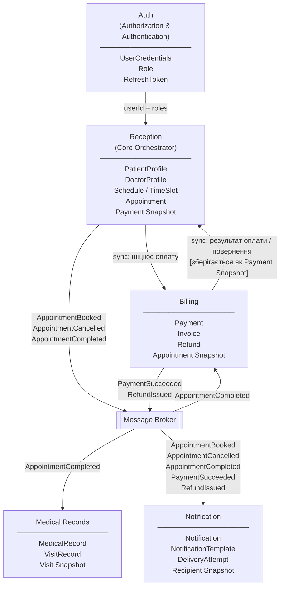
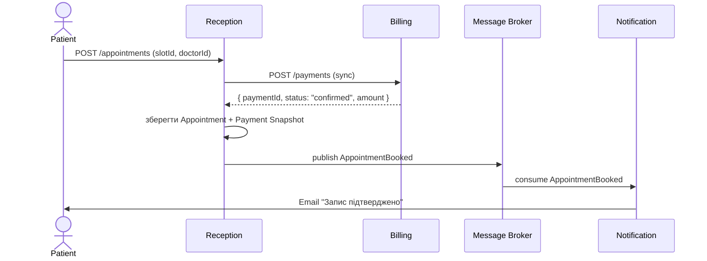
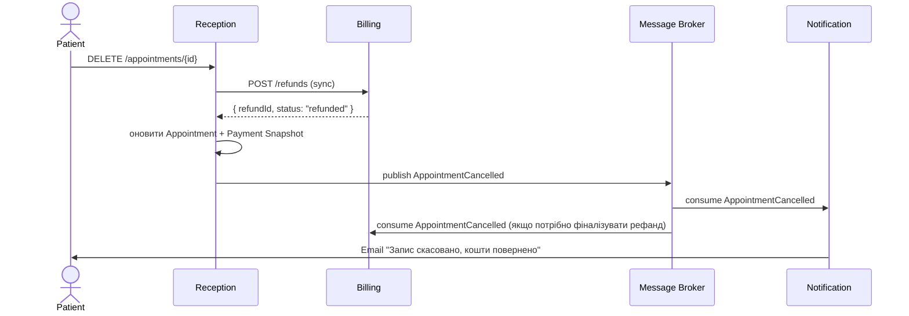
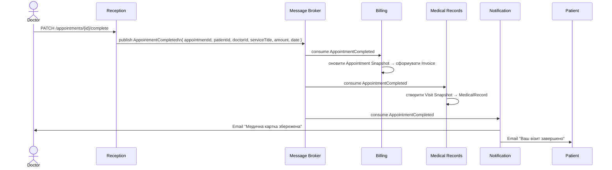

# Medical Center System

## Вибір бізнес-домену
Обрана предметна область - медичний сервіс з можливістю онлайн запису до лікаря. Система є платформою для управління записами на прийом до клініки, яка об'єднує планування розкладу лікарів, проведення фінансових операцій, ведення електронних медичних карток, управління ідентифікацією та інформування користувачів.

**Архітектурний стиль:** Event-Driven Microservices з брокером повідомлень як центральним транспортним шаром. Кожен мікросервіс є автономним, має власну базу даних та спілкується з іншими виключно через події або API-запити.

## Ключові бізнес-сценарії
* Перший сценарій описує оформлення запису, де пацієнт обирає вільний слот у розкладі лікаря, система ініціює перевірку оплати, фіксує бронювання та надсилає підтвердження. 
* Другий сценарій охоплює скасування запису пацієнтом, що призводить до звільнення слота та автоматичного повернення коштів. 
* Третій сценарій стосується завершення візиту: лікар заповнює медичну картку, а білінг формує фінальний акт.

## Виділення Bounded Contexts
Існуючі домени: 
* Домен Reception виступає операційним ядром, яке централізовано зберігає профілі пацієнтів та лікарів, управляє розкладами і виступає головним оркестратором процесів бронювання часу. 
* Домен Billing ізолює фінансові транзакції та обробку рахунків. 
* Домен Medical Records відповідає за збереження історії візитів як окремих документів.
* Домен Authorization + Auntification - це збереження пошти, логінів, хешів паролів, базових ролей користувачів та генерація токенів доступу. 
* Домен Notification слугує виключно для відправки сповіщень.

## Опис рішень 
Система створена на основі незалежних ікросервісів з event-driven взаємодією через брокер повідомлень. Кожен домен відпоідає тільки за свою частину функціоналу і ініціалізує події замість синхроних колів API. Синхронна взаємодія існує тільки між Reception та Billing при ініціації оплати та поверненні коштів, оскільки Reception не може зберегти Appointment без підтвердженого результату.  
Для автономності сервісів застосований Snapshot-патерн: у момент події кожен сервіс фіксує локальну копію необхідних даних замість того, щоб запитувати їх в іншого сервісу.
Reception виступає оркестратором - він керує розкладом, слотами та станом Appointment і публікує ключові події системи. Auth винесений в окремий сервіс, оскільки зберігає технічні дані автентифікації, не пов'язані з жодним бізнес-доменом.

## Схема контекстів (Context Map)
 
> Діаграма описує статичні відносини між контекстами: хто є Upstream (Supplier) і хто Downstream (Customer), а також характер взаємодії.
 

## Event-Driven Architecture: 
 
> Sequence Diagrams для кожного зі сценаріїв
 
### Сценарій 1 - Оформлення запису
 

 
### Сценарій 2 - Скасування запису
 

 
### Сценарій 3 - Завершення візиту
 

